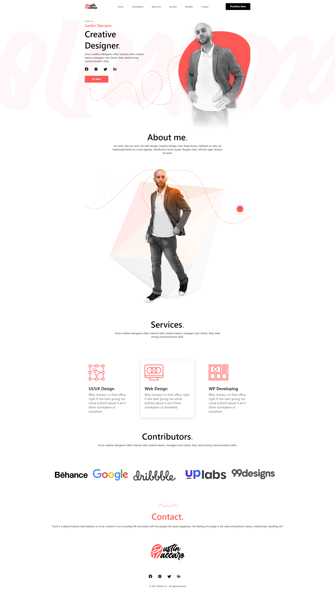

<p align="center">
  
</p>

## :rocket: Tecnologias

- [React.js](https://pt-br.reactjs.org/)
- [Next.js](https://nextjs.org/)
- [TypeScript](https://www.typescriptlang.org/)
- [React-icons](https://heroicons.com/)
- [Styled-componets](https://tailwindcss.com/)

## 💻 Sobre o projeto

Criar uma landing page de perfil profissional como forma de aprendizagem e treinar as skills perante o uso de TypeScript, React e CSS.

- [DEMO](https://justinvacaro-7p4z8wzea-renatodaltiba.vercel.app/)

## 📥 Instalação e execução

Faça um clone desse repositório e acesse o diretório.

```bash
$ git clone https://github.com/renatodaltiba/portfolio_justinVaccaro.git && cd portfolio_justinVaccaro
```

```bash
# Instalando as dependências
$ yarn
# Executanto aplicação
$ yarn start
```

## :muscle: Contribuir

Faça o `fork` e clone o projeto a partir do seu usuário.

```bash
# Clonando projeto
$ git clone https://github.com/SEU-NOME-DE-USUARIO/portfolio_justinVaccaro.git
# Criando um branch
$ git branch minha-alteracao
# Acessando o novo branch
$ git checkout -b minha-alteracao
# Adicionando os arquivos alterados
$ git add .
# Criando commit e a mensagem
$ git commit -m "Corrigindo...."
# Enviando alterações para o brach
$ git push origin minha-alteracao
```

Você deve navegar até o seu repositório onde fez o fork e clicar no botão _New pull request_ no lado esquerdo da página.

## 📝 Licença

Esse projeto está sob a licença MIT. Veja o arquivo [LICENSE](LICENSE.md) para mais detalhes.
